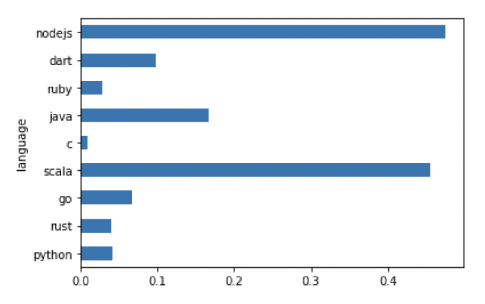

# Fizz Buzz Benchmarks

Tool of benchmark results of Fizz Buzz implementation in each programing languages.

## Languages

|  Language  |  Suport?  |
| ---- | ---- |
|  Python  |  👍  |
|  Rust  |  👍  |
|  Go  |  👍  |
|  Scala  |  👍  |
|  Scala(sbt)  |  🙅‍♂️  |
|  C  |  👍  |
|  Java  |  👍  |
|  Ruby  |  👍  |
|  Dart  |  👍  |
|  Node.js  |  👍  |
|  C#  |  🙇‍♂️(TBD)  |
|  C++  |  🙇‍♂️(TBD)  |

Currenly, version issue is not considered well. Kindly send issues/PRs.

## Setup

### Notebook

You need to install these python libs.
```
ipykernel
pandas
matplotlib
jupyter
```

e.g.
```
$ pip install ipykernel pandas matplotlib jupyter
```

### Languages

Also need to set up CLIs of each langs.

|  Language  |  CLIs  |
| ---- | ---- |
|  Python  |  `python`  |
|  Rust  |  `cargo`, `rustc`  |
|  Go  |  `go`  |
|  Scala  |  `scala`, `scalac`  |
|  C  |  `cc`  |
|  Java  |  `java`, `javac`  |
|  Ruby  |  `ruby`  |
|  Dart  |  `dart`  |
|  Node.js  |  `node`  |

You can check which is not installed just by putting below CLI string into shell command (like `$ python --help`).

If you won't use some langs, please remove them from `conf/languages.csv`.

## Run Benchmark Example

### by Jupyter Notebook

Run `jupyter notebook` on root repo directory.
```
$ pwd
/<your-directory>/fizz-buzz-benchmarks
$ jupyter notebook
[I 04:36:01.371 NotebookApp] ...
```

And access to http://localhost:8888/notebooks/example.ipynb

### by VS Code

See https://code.visualstudio.com/docs/datascience/jupyter-notebooks

Try it on `example.ipynb`.

## Run Benchmarks By Templates

If you want to fix, copy it!

e.g https://github.com/sadahiroyoshi/fizz-buzz-benchmarks/blob/main/println.template.ipynb

## Test

You can test all logic on your device by this `unittest` command on root repo directory.

```
$ pwd
/<your-directory>/fizz-buzz-benchmarks
$ python -m unittest discover -s test -p '*_test.py'
..........
----------------------------------------------------------------------
Ran 10 tests in 106.108s

OK
```

## ⚠CAUTION

### nodejs

In this repo, manually compiled js files by [Closure Compiler](https://closure-compiler.appspot.com/).

But this script (by Closure Compiler) causes error,
```
a=process.g[2]
```
so if you want to re-compile, please rewrite it manually.
```
a=process.argv[2]
```
